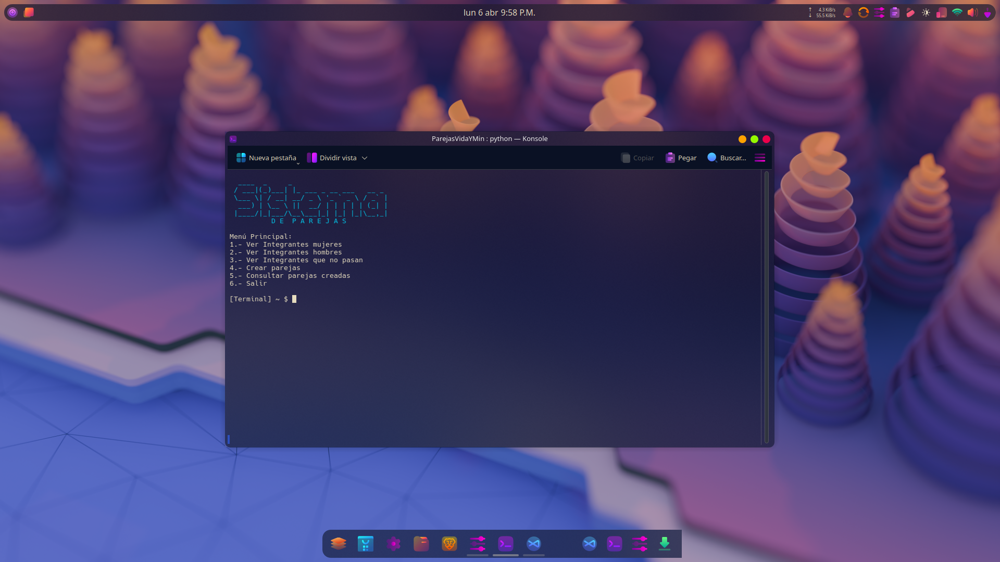
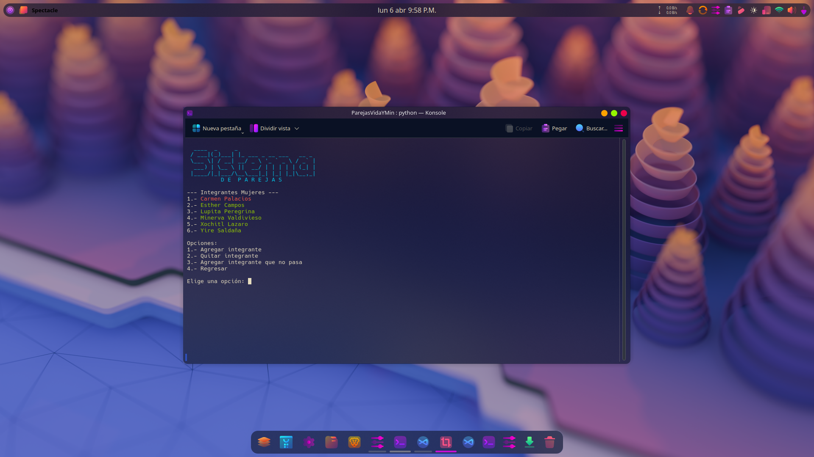
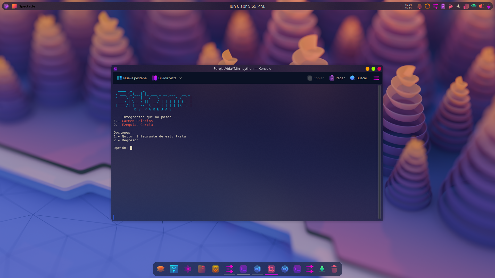
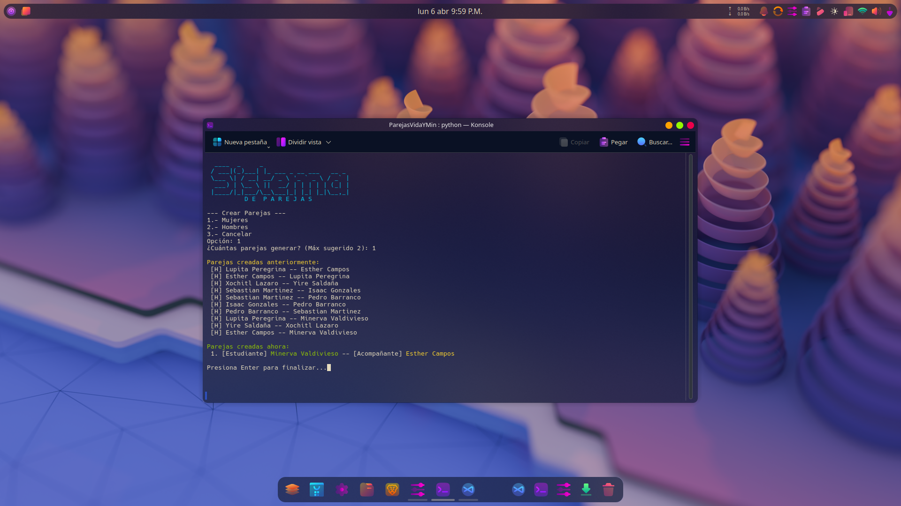
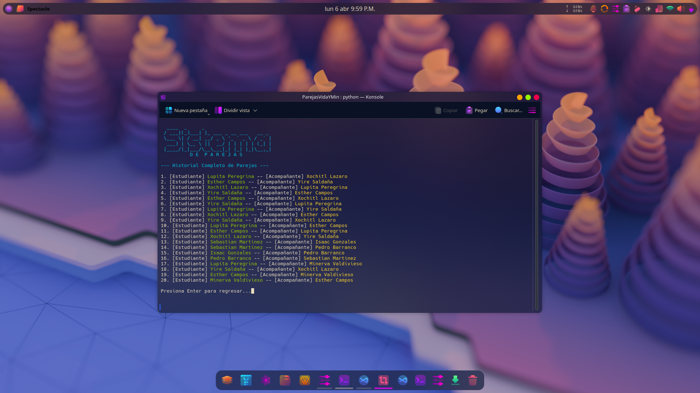

# 💻 Sistema de Generación de Parejas  
### by **F3NR1R**


---

# [alfonso@f3nr1r ~]$ neofetch

```text
                   -`                    Alfonso Saldaña Campos (F3NR1R)
                  .o+`                   ----------------------
                 `ooo/                   OS: Arch Linux x86_64
                `+oooo:                  DEGREE: B.S. Computer Science (BUAP)
               `+oooooo:                 GPA: 8.3 / 10.0
               -+oooooo+:                KERNEL: Linux-6.x.x-arch1-1
             `/:-:++oooo+:               SHELL: zsh
            `/++++/+++++++:              SPECIALTY: Networks, Server Administrator & Cybersec
           `/++++++++++++++:             EXPERIENCE: Junior NetAdmin @ ASR-BUAP
          `/+++ooooooooooooo/`           GOAL: Astrophysics & Astro-Data Analysis
         ./ooossssqssoooosssso`
         .oossssso-````/ossssss+          [■■■■■■■■■□□□] 80% Processing Data
        -osssssso.      :ssssssso.
       :osssssss/        ossssoooo.       "The universe is just code waiting
      /ossssssss/        +ssssooo/-        to be refactored."
    `/ossssso+/:-        -:/+osssso+-     "Ad astra per aspera"
   `+sso+:-`                 `.-/+oso:
  `++:.                            `:/+/
  .`                                  `/
```

---

## 🧠 ¿Qué hace este programa?

Sistema para generar parejas evitando repeticiones usando lógica y aleatoriedad.

---

## ⚙️ ¿Cómo funciona?

1. Lee listas desde archivos  
2. Filtra personas excluidas  
3. Mezcla aleatoriamente  
4. Evita repetir parejas  
5. Guarda historial  

---

## 📂 Archivos

- IntegrantesMujeres.txt  
- IntegrantesHombres.txt  
- NoPasan.txt  
- ParejasEchas.txt  

---

## 🧭 Menú

1. Ver integrantes  
2. Gestionar listas  
3. Excluir personas  
4. Crear parejas  
5. Ver historial  

<p align="center">
  
</p>

<p align="center">
  
</p>

<p align="center">
  
</p>

<p align="center">
  
</p>

<p align="center">
  
</p>

<p align="center">
  
</p>


---

## 🧠 Lógica clave

- Usa combinaciones: N * (N - 1)  
- Hace múltiples intentos  
- Minimiza repeticiones  

---

## 🖥️ Ejecutar

### Linux / Mac
```bash
python3 programa.py
```

### Windows
```bash
python programa.py
```

---

## 📦 Requisitos

- Python 3  

---

## ⚙ Cómo COMPILAR a ejecutable

### 🪟 Windows (EXE)

1. Instala PyInstaller:
```bash
pip install pyinstaller
```

2. Compila:
```bash
pyinstaller --onefile programa.py
```

3. Ejecutable en:
```
dist/programa.exe
```

---

### 🐧 Linux

```bash
pip install pyinstaller
pyinstaller --onefile programa.py
```

Ejecutable:
```
dist/programa
```

---

### 🍎 Mac

```bash
pip3 install pyinstaller
pyinstaller --onefile programa.py
```

Ejecutable:
```
dist/programa
```

---


## 🧱 Estructura

```
proyecto/
├── programa.py
├── IntegrantesMujeres.txt
├── IntegrantesHombres.txt
├── NoPasan.txt
└── ParejasEchas.txt
```

---

"Ad astra per aspera"
